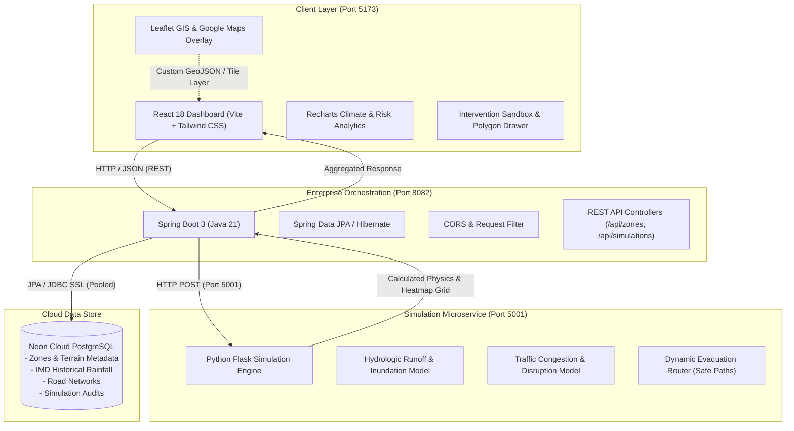

# 🌐 UrbanTwin: Predictive Urban Digital Twin

> **AI-Powered Urban Infrastructure Simulation, Flood Inundation Modeling & Dynamic Evacuation Routing for Climate-Resilient Cities**  
> *Developed for the Smart India Hackathon (SIH) — Smart Cities & Disaster Resilience Challenge*

[](https://react.dev/)
[](https://vitejs.dev/)
[](https://spring.io/projects/spring-boot)
[](https://flask.palletsprojects.com/)
[](https://neon.tech/)
[](https://tailwindcss.com/)
[](https://openjdk.org/)
[](https://www.python.org/)

---

## 📖 Table of Contents
- [Executive Overview](#-executive-overview)
- [System Architecture](#-system-architecture)
- [Microservices & Port Allocation](#-microservices--port-allocation)
- [Directory Structure](#-directory-structure)
- [Prerequisites](#-prerequisites)
- [Quick Start (One-Click Startup)](#-quick-start-one-click-startup)
- [Manual Step-by-Step Setup](#-manual-step-by-step-setup)
  - [1. Database Configuration (Neon PostgreSQL)](#1-database-configuration-neon-postgresql)
  - [2. Simulation Engine (Flask - Port 5001)](#2-simulation-engine-flask---port-5001)
  - [3. Enterprise Backend (Spring Boot - Port 8082)](#3-enterprise-backend-spring-boot---port-8082)
  - [4. Frontend Dashboard (React + Vite - Port 5173)](#4-frontend-dashboard-react--vite---port-5173)
  - [5. Standalone Flask Backend (Optional - Port 5000)](#5-standalone-flask-backend-optional---port-5000)
- [Environment Variables](#-environment-variables)
- [Core Features & Simulation Capabilities](#-core-features--simulation-capabilities)
- [API Reference](#-api-reference)
- [Stopping the Application](#-stopping-the-application)
- [Troubleshooting & FAQ](#-troubleshooting--faq)
- [License & Acknowledgments](#-license--acknowledgments)

---

## 🏙️ Executive Overview

Rapid urbanization and escalating climate risks expose metropolitan hubs to flash floods, critical road severance, and severe emergency response delays. Traditional planning tools operate in static silos and fail to capture cascading impacts before construction begins.

**UrbanTwin** solves this by providing an end-to-end **Predictive Urban Digital Twin**:
1. **Interactive Geospatial Digital Twin**: Map-based visualization of urban morphology, elevation contours, critical infrastructure, and real-time precipitation.
2. **Dynamic Intervention Testing**: Simulate the hydrologic and traffic impacts of planned high-rises, road widenings, and green sponge-city infrastructure prior to breaking ground.
3. **Physics-Driven Hydrologic Modeling**: Estimates surface runoff coefficients, water displacement, max inundation depths, and spatial heatmaps across terrain topologies.
4. **Traffic & Evacuation Routing**: Evaluates road impassability and computes fail-safe evacuation paths to high-ground relief centers avoiding inundated corridors.
5. **Historical IMD Climate Analytics**: Incorporates multi-year precipitation trends (2015–2024) to simulate 10-year and 50-year storm recurrence intervals.

---

## 🏗️ System Architecture

UrbanTwin employs a decoupled, microservice-based architecture designed for low latency, scalability, and modular expansion:



---

## 🔌 Microservices & Port Allocation

| Component | Technology | Default Port | Primary Purpose |
| :--- | :--- | :--- | :--- |
| **Frontend Dashboard** | React 18, Vite, Tailwind CSS, Leaflet | `5173` | Interactive 2D/3D map, intervention designer, results visualization |
| **Enterprise Backend** | Java 21, Spring Boot 3, Spring Data JPA | `8082` | Business logic, zone management, simulation orchestration, DB persistence |
| **Simulation Engine** | Python 3.10+, Flask, NumPy | `5001` | Hydrologic runoff physics, waterlogging heatmaps, traffic & evacuation routing |
| **Managed Database** | PostgreSQL 16 on Neon Cloud | `5432` (Cloud) | Persistent storage of pilot zones, elevation benchmarks, IMD data, and runs |
| **Standalone Flask Backend** *(Optional)* | Python Flask, SQLAlchemy, SQLite/PostgreSQL | `5000` | Lightweight monolithic fallback if Java/Maven is unavailable |

---

## 📂 Directory Structure

```text
predictive-urban-digital-twin/
├── database/                    # Database DDL and seeding scripts
│   ├── schema.sql               # PostgreSQL tables (zones, rainfall, elevation, roads, simulations)
│   └── seed.sql                 # Bengaluru pilot zones (Indiranagar, HSR Layout, Koramangala, etc.)
├── springboot-backend/          # Java Spring Boot 3 microservice
│   ├── src/main/java/com/urbantwin/
│   │   ├── config/              # CORS and RestTemplate configurations
│   │   ├── controller/          # REST endpoints (ZoneController, SimulationController, HealthController)
│   │   ├── dto/                 # API request/response wrappers
│   │   ├── entity/              # JPA Entities (Zone, Simulation, FloodResult)
│   │   ├── repository/          # Spring Data JPA repositories
│   │   └── service/             # Orchestration service & Flask client bridge
│   ├── src/main/resources/
│   │   └── application.properties # Spring configuration & Neon connection
│   ├── pom.xml                  # Maven dependencies & build definitions
│   └── start.bat                # Dedicated Spring Boot launcher
├── simulation-engine/           # Python Flask simulation microservice
│   ├── simulation/
│   │   ├── flood.py             # Hydrologic runoff, depth & building risk formulas
│   │   ├── traffic.py           # Traffic congestion & diversion modeling
│   │   ├── routing.py           # Safe evacuation routing bypassing waterlogging
│   │   └── risk.py              # Combined multi-factor simulation evaluator
│   ├── app.py                   # Flask server entry point (Port 5001)
│   └── requirements.txt         # Flask, NumPy, Flask-CORS, python-dotenv
├── backend/                     # Standalone Python Flask backend (Alternative/Legacy on Port 5000)
│   ├── app.py                   # Standalone REST API with SQLite / Postgres fallback
│   ├── models.py                # SQLAlchemy ORM models
│   ├── config.py                # Database configuration
│   └── requirements.txt         # Standalone dependencies
├── src/                         # React Frontend Application
│   ├── components/              # UI widgets (Map, Header, InterventionPanel, Analytics, History)
│   ├── data/                    # Mock benchmarks and pilot data fallbacks
│   ├── services/                # API client (apiClient.js talking to Spring Boot on 8082)
│   ├── App.jsx                  # Root application layout & state manager
│   └── main.jsx                 # React DOM mount point
├── start.bat                    # One-click Windows multi-service launcher
├── start.ps1                    # One-click PowerShell launcher with colored logging
├── start.sh                     # One-click POSIX Bash launcher (Linux / macOS / WSL)
├── stop.bat                     # Windows utility to kill all UrbanTwin processes
├── stop.ps1                     # PowerShell utility to stop all UrbanTwin processes
├── stop.sh                      # POSIX Bash utility to stop all UrbanTwin processes
├── package.json                 # Frontend dependencies & npm scripts
└── README.md                    # Project documentation
```

---

## ⚙️ Prerequisites

Ensure the following tools are installed on your workstation:

1. **Node.js**: `v18.0.0` or higher ([Download Node.js](https://nodejs.org/))
2. **Java Development Kit (JDK)**: `v17` or `v21` ([Eclipse Adoptium Temurin](https://adoptium.net/))
3. **Apache Maven**: `v3.8+` ([Download Maven](https://maven.apache.org/))
4. **Python**: `v3.10+` ([Download Python](https://www.python.org/)) or [uv](https://github.com/astral-sh/uv)
5. **Git**: Latest version

Verify your environment by running:
```bash
node -v
mvn -v
java -version
python --version  # or 'py --version'
```

---

## 🚀 Quick Start (One-Click Startup)

UrbanTwin comes with automated startup scripts that check prerequisites, verify dependencies, and launch all 3 microservices simultaneously in separate console windows.

### 📍 Step 1: Open Terminal in the Project Directory
First, open your terminal (PowerShell, Command Prompt, or Bash) and navigate to the project directory:

```powershell
# In PowerShell or Command Prompt:
cd "c:\Users\prajwal sk\.gemini\antigravity\scratch\predictive-urban-digital-twin"
```
*(Or right-click inside the project folder in Windows File Explorer and choose **"Open in Terminal"**).*

---

### 🚀 Step 2: Run the Startup Script

#### Option A: Windows (Batch - Double-Click or CMD)
You can simply double-click `start.bat` in File Explorer, or execute in terminal:
```cmd
start.bat
```

#### Option B: Windows (PowerShell)
```powershell
.\start.ps1
```
*Helpful parameters:*
- `.\start.ps1 -OpenBrowser` — Automatically opens `http://localhost:5173` in your default browser.
- `.\start.ps1 -Mode All` — Starts all 3 services (default).
- `.\start.ps1 -Mode Simulation` — Runs only the Flask simulation microservice.
- `.\start.ps1 -Mode Backend` — Runs only the Spring Boot backend.
- `.\start.ps1 -Mode Frontend` — Runs only the React frontend.

#### Option C: Linux / macOS / WSL / Git Bash
```bash
chmod +x start.sh stop.sh
./start.sh
```

> **Note:** All startup scripts automatically detect their own path (`cd /d "%~dp0"` / `Set-Location $PSScriptRoot`), meaning you can also safely invoke them from any directory or via desktop shortcut.
*To stop all running services in bash, simply press `Ctrl+C` in the terminal where `./start.sh` is active.*

---

## 🛠️ Manual Step-by-Step Setup

If you prefer launching components individually in separate terminals:

### 1. Database Configuration (Neon PostgreSQL)
UrbanTwin is pre-configured to communicate with a managed **Neon Cloud PostgreSQL** database.
If you wish to initialize your own PostgreSQL database:
```bash
# Connect to your PostgreSQL instance and execute:
psql -U your_user -d your_database -f database/schema.sql
psql -U your_user -d your_database -f database/seed.sql
```

### 2. Simulation Engine (Flask - Port 5001)
```bash
cd simulation-engine

# Create virtual environment (or use uv)
python -m venv .venv

# Activate virtual environment
# Windows:
.venv\Scripts\activate
# Linux/macOS:
source .venv/bin/activate

# Install dependencies
pip install -r requirements.txt

# Run the simulation engine
python app.py
```
> The simulation engine will start on **`http://localhost:5001`**. Test it at `http://localhost:5001/health`.

### 3. Enterprise Backend (Spring Boot - Port 8082)
Open a new terminal:
```bash
cd springboot-backend

# Set environment variables (Windows cmd example):
set POSTGRES_JDBC_URL=jdbc:postgresql://ep-snowy-darkness-b3g2skxt-pooler.c-4.ap-southeast-1.aws.neon.tech/neondb?sslmode=require
set POSTGRES_USER=neondb_owner
set POSTGRES_PASSWORD=npg_4nGMfFDJ1oXe
set FLASK_SIM_URL=http://localhost:5001
set CORS_ORIGINS=http://localhost:3000,http://localhost:5173

# Run via Maven
mvn spring-boot:run
```
> The Spring Boot backend will start on **`http://localhost:8082`**. Test it at `http://localhost:8082/api/health`.

### 4. Frontend Dashboard (React + Vite - Port 5173)
Open a new terminal in the project root:
```bash
# Install node packages
npm install

# Start the Vite development server
npm run dev
```
> Access the interactive digital twin interface at **`http://localhost:5173`**.

### 5. Standalone Flask Backend (Optional - Port 5000)
If Java/Maven is unavailable on your system, you can optionally run the legacy standalone Python backend:
```bash
cd backend
python -m venv .venv
# Activate venv and run:
pip install -r requirements.txt
python app.py
```
> Then in the web UI, open the **Backend Config Modal** (cog icon) and switch the backend URL to `http://localhost:5000/api`.

---

## 🔐 Environment Variables

### Root (`.env`)
```env
# Optional Google Maps API key for hybrid satellite tiles
VITE_GOOGLE_MAPS_API_KEY=AIzaSy...
```

### Spring Boot Backend (`springboot-backend/.env` or system env)
```env
POSTGRES_JDBC_URL=jdbc:postgresql://ep-snowy-darkness-b3g2skxt-pooler.c-4.ap-southeast-1.aws.neon.tech/neondb?sslmode=require
POSTGRES_USER=neondb_owner
POSTGRES_PASSWORD=npg_4nGMfFDJ1oXe
FLASK_SIM_URL=http://localhost:5001
CORS_ORIGINS=http://localhost:3000,http://localhost:5173
```

---

## 🎯 Core Features & Simulation Capabilities

### 1. Bengaluru Pilot Zones & Custom Polygons
- Pre-loaded zones with terrain elevations, water bodies, and catchment demographics:
  - **Indiranagar** (12.9784° N, 77.6408° E | Base Elevation: 885m)
  - **HSR Layout** (12.9116° N, 77.6389° E | Base Elevation: 875m)
  - **Koramangala** (12.9348° N, 77.6253° E | Base Elevation: 870m)
  - **Whitefield** (12.9698° N, 77.7499° E | Base Elevation: 890m)
  - **Electronic City** (12.8452° N, 77.6602° E | Base Elevation: 895m)
- **Interactive Freehand Polygon**: Draw arbitrary study areas directly onto the Leaflet map to test micro-developments anywhere in the city.

### 2. Multi-Variable Intervention Modeling
- **Intervention Types**:
  - `NEW_CONSTRUCTION`: Multi-story developments with structural footprint displacement.
  - `ROAD_WIDENING`: Paved surface expansion causing increased impervious runoff.
  - `GREEN_BUFFER`: Bioswales and retention zones that reduce water accumulation.
- **Surface Materials & Runoff Coefficients ($C$)**:
  - **Concrete / Standard Asphalt** ($C = 0.92$ – $0.95$): High surface runoff.
  - **Permeable Pavers / Porous Concrete** ($C = 0.35$): High infiltration, drastic reduction in peak surface accumulation.

### 3. Hydrologic Inundation Physics
- Calculates total runoff volume ($V = C \cdot I \cdot A$) factoring in structural displacement.
- Generates dynamic $(9 \times 9)$ spatial flood risk heatmaps with color-coded risk bands:
  - 🔵 **Low Risk** ($< 0.5\text{ m}$)
  - 🟡 **Moderate Risk** ($0.5\text{ m} - 1.0\text{ m}$)
  - 🟠 **High Risk** ($1.0\text{ m} - 2.0\text{ m}$)
  - 🔴 **Critical Inundation** ($\ge 2.0\text{ m}$)

### 4. Dynamic Evacuation & Road Connectivity
- Identifies severed and impassable road links based on flood depth thresholds.
- Computes safe egress waypoints routing citizens away from low-elevation inundation zones toward designated high-ground stadiums and emergency shelters.

---

## 📡 API Reference

### Spring Boot Backend (`http://localhost:8082/api`)

#### 1. System Health Check
- **Endpoint**: `GET /api/health`
- **Response**:
```json
{
  "status": "UP",
  "service": "UrbanTwin Spring Boot Backend",
  "database": "Neon PostgreSQL (Connected)",
  "simulationEngine": "http://localhost:5001"
}
```

#### 2. Get All Zones
- **Endpoint**: `GET /api/zones`
- **Response**:
```json
{
  "success": true,
  "data": [
    {
      "id": 1,
      "zoneId": "indiranagar",
      "name": "Indiranagar",
      "city": "Bengaluru",
      "centerLat": 12.9784,
      "centerLng": 77.6408,
      "areaKm2": 0.42,
      "baseElevation": 885.0
    }
  ]
}
```

#### 3. Run Simulation
- **Endpoint**: `POST /api/simulations/run`
- **Payload**:
```json
{
  "zoneId": "indiranagar",
  "changeType": "NEW_CONSTRUCTION",
  "footprintArea": 1200.0,
  "floors": 10,
  "materialId": "concrete",
  "rainfallMmHr": 85.0
}
```
- **Response**:
```json
{
  "success": true,
  "data": {
    "simulationId": 42,
    "simulationCode": "SIM-INDIRANAGAR-20260919",
    "metrics": {
      "estMaxWaterDepthM": 1.48,
      "affectedAreaKm2": 0.22,
      "buildingsAtRiskCount": 31,
      "majorWaterloggingPointsCount": 4,
      "cutOffRoadCount": 2,
      "totalEvacuationTimeMin": 36
    },
    "floodRiskPoints": [
      {
        "id": "fp_0_0",
        "lat": 12.9784,
        "lng": 77.6408,
        "depth": 1.48,
        "riskCategory": "high",
        "color": "#f97316",
        "radius": 37.0
      }
    ],
    "evacuationPath": [
      [12.9724, 77.6358],
      [12.9754, 77.6388],
      [12.9794, 77.6418],
      [12.9834, 77.6458]
    ]
  }
}
```

#### 4. Historical Simulation Runs
- **Endpoint**: `GET /api/simulations/zone/{zoneId}`
- Returns past simulation runs and risk scores for that zone.

---

### Flask Simulation Engine (`http://localhost:5001`)

| Method | Endpoint | Description |
| :--- | :--- | :--- |
| `GET` | `/health` | Health status and engine version |
| `POST` | `/simulation/flood` | Raw flood depth and building risk calculations |
| `POST` | `/simulation/traffic` | Traffic congestion scores and diversion indices |
| `POST` | `/simulation/combined` | Comprehensive simulation run (Flood + Traffic + Heatmap) |
| `POST` | `/routing/evacuation` | Safe waypoint path calculation |

---

## 🛑 Stopping the Application

To shut down all background microservices on ports `5173`, `8082`, `5001`, and `5000`:

- **Windows**: Run `stop.bat` or `.\stop.ps1`
- **Linux / macOS**: Run `./stop.sh` or press `Ctrl+C` in the `start.sh` window.

---

## ❓ Troubleshooting & FAQ

### 1. Port Conflict (`Port 8082`, `5001`, or `5173` already in use)
Run `stop.bat` (Windows) or `./stop.sh` (Unix) to kill lingering processes.  
Alternatively, check running processes manually:
```cmd
# Windows CMD:
netstat -ano | findstr :8082
taskkill /F /PID <PID_NUMBER>
```

### 2. Python Launch Error (`C:\Python314\python.exe not found`)
If your Windows registry has a stale Python path, `start.bat` automatically looks for `simulation-engine\.venv\Scripts\python.exe` or `uv`.  
You can manually activate the virtual environment:
```powershell
cd simulation-engine
& ".\.venv\Scripts\activate.ps1"
python app.py
```

### 3. PostgreSQL SSL Handshake Error
Neon Cloud requires SSL. Ensure your connection string includes `?sslmode=require`:
```text
jdbc:postgresql://<neon-host>/neondb?sslmode=require
```

### 4. Leaflet Map Tiles Not Loading
Ensure you have an active internet connection to stream OpenStreetMap tiles. If using the Google Maps hybrid layer, verify that `VITE_GOOGLE_MAPS_API_KEY` in `.env` is valid.

---

## 👥 Authors & Acknowledgments

- **Developed by Team UrbanTwin** for the Smart India Hackathon (SIH).
- Meteorological benchmark data sourced from **India Meteorological Department (IMD)** historical records.
- Elevation data modeled from **SRTM 30m Digital Elevation Models (DEM)**.
